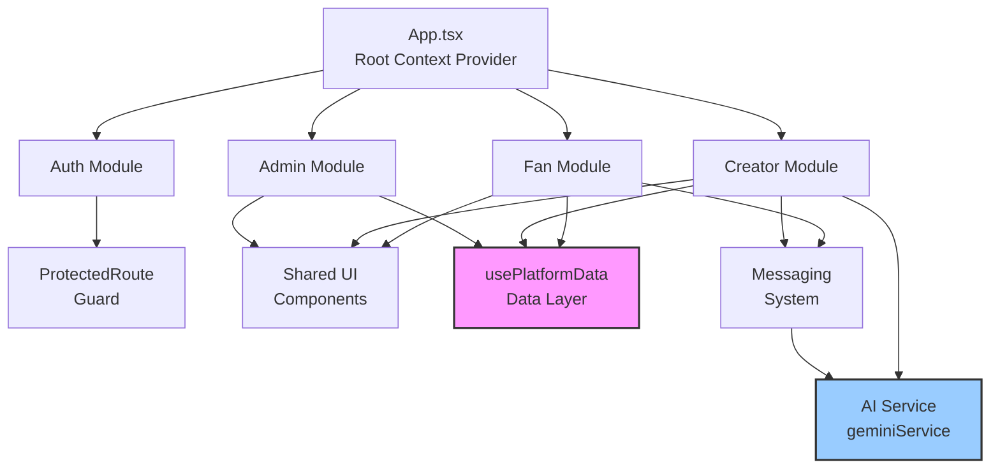

# ARCHITECTURE.md

## Executive Summary

- **Pure frontend demo**: React 19 SPA with simulated backend using in-memory state (`hooks/usePlatformData.ts:6-109`)
- **No real persistence**: All data (users, posts, messages) stored in React state, resets on page refresh
- **Three-role system**: Fan, Creator, Admin with protected route shells and role-specific dashboards
- **AI-powered features**: Google Gemini API for post drafting, reply suggestions, and audio transcription
- **Authentication is simulated**: Hardcoded user switching via login screen, no real auth tokens or session management
- **Zero backend**: No API routes, no database, no server-side logic beyond Vite dev server
- **Production-ready gaps**: Missing tests, CI/CD, real auth, data persistence, API layer, error monitoring

---

## Tech Stack

### Frontend
- **React**: 19.2.0 (latest stable) - `package.json:14`
- **TypeScript**: ~5.8.2 with relaxed config (`allowJs: true`, no strict mode) - `tsconfig.json:2-28`
- **Bundler**: Vite 6.2.0 - `package.json:22`, dev server on port 3000 - `vite.config.ts:9`
- **Routing**: React Router v7.9.5 (client-side only) - `package.json:16`, `index.tsx:4,15`
- **Styling**: Tailwind CSS 3.x via CDN - `index.html:8,36-55`
- **Icons**: lucide-react ^0.548.0 - `package.json:13`

### AI Integration
- **Provider**: Google Gemini API via `@google/genai` ^1.27.0 - `package.json:12`
- **Models used**:
  - `gemini-2.5-pro` for post drafting - `services/geminiService.ts:74`
  - `gemini-2.5-flash` for reply suggestions and audio transcription - `services/geminiService.ts:118,189`

### Build & Dev Tools
- **Package Manager**: npm (lockfile present: `package-lock.json`)
- **Dev Dependencies**: `@vitejs/plugin-react`, `@types/node` - `package.json:18-22`
- **Scripts**:
  - `npm run dev` → `vite` - starts dev server on http://localhost:3000
  - `npm run build` → `vite build` - produces optimized production bundle
  - `npm run preview` → `vite preview` - previews production build locally

### Runtime & Deployment
- **Target**: Browser-only (no SSR, no Node.js server)
- **Entry Point**: `index.html:71` → `index.tsx:7-19` → `App.tsx:46-104`
- **Import Maps**: CDN-based for dependencies in browser - `index.html:57-67`

---

## Route Map

### Router Implementation
- **Type**: React Router v7 (BrowserRouter) - `index.tsx:4,15`
- **Route Definitions**: All in `App.tsx:58-100`
- **Strategy**: Nested routes with layout shells for each role

### Public Routes (Unauthenticated)
```
/ → LandingPage.tsx:4-32
  - Hero page with "Log In" and "Sign Up" buttons

/auth/login → LoginScreen.tsx:7-39
  - Simulated login: hardcoded user selection (fan/creator/admin)
  - Callback: App.tsx:51-53 sets currentUserId

/auth/signup → SignupPage.tsx:4-24
  - Placeholder page ("coming soon"), redirects to login

/@:handle → PublicCreatorProfilePage.tsx:11-161
  - Dynamic route for creator profiles (e.g., /@elenavoyage)
  - Accessible without authentication
  - Shows public posts; private posts locked behind subscribe gate
```

### Protected Routes (Role-Based)

#### Fan Routes (`/fan/*`)
**Shell**: `routes/FanRoutes.tsx:10-88` (Header + BottomNav + Outlet)
**Guard**: `components/ProtectedRoute.tsx:10-30` checks `allowedRoles: ['fan']` - `App.tsx:66`

```
/fan → redirects to /fan/home
/fan/home → components/pages/FanHomePage.tsx
  - Main feed: subscribed creators' posts + public posts
/fan/discover → components/pages/FanDiscoverPage.tsx
  - Discover feed: public posts from non-subscribed creators
/fan/messages → components/pages/FanMessagesPage.tsx
  - Message inbox with conversation list
/fan/messages/:conversationId → FanMessagesPage.tsx (same component, uses param)
  - Individual conversation view with AI reply suggestions
```

#### Creator Routes (`/creator/*`)
**Shell**: `routes/CreatorRoutes.tsx:10-115` (Header + Sidebar + BottomNav + Outlet)
**Guard**: `ProtectedRoute` checks `allowedRoles: ['creator']` - `App.tsx:77`

```
/creator → redirects to /creator/dashboard
/creator/dashboard → components/pages/CreatorDashboardPage.tsx
  - Stats: total followers, total tips, post count
/creator/posts → components/pages/CreatorPostsPage.tsx
  - Manage posts: create, edit, delete, toggle privacy
/creator/settings → components/pages/CreatorSettingsPage.tsx
  - Edit profile: bio, banner, access code, subscription price
/creator/messages → components/pages/CreatorMessagesPage.tsx
  - Creator message inbox
/creator/messages/:conversationId → CreatorMessagesPage.tsx
  - Individual fan conversations
```

#### Admin Routes (`/admin/*`)
**Shell**: `routes/AdminRoutes.tsx:6-124` (Header + Sidebar + Outlet)
**Guard**: `ProtectedRoute` checks `allowedRoles: ['admin']` - `App.tsx:89`

```
/admin → redirects to /admin/dashboard
/admin/dashboard → components/pages/AdminDashboardPage.tsx
  - Platform overview stats
/admin/creators → components/pages/AdminCreatorsPage.tsx
  - Verify/unverify creators
/admin/content → components/pages/AdminContentPage.tsx
  - Remove posts (content moderation)
```

#### Catch-all
```
/* → Navigate to="/" replace - App.tsx:99
```

### Route Protection Flow
1. `App.tsx:48` checks if `currentUserId` exists → finds `currentUser` in state
2. `ProtectedRoute.tsx:11-13` redirects to `/auth/login` if no user
3. `ProtectedRoute.tsx:15-27` role check: redirect to user's home dashboard if role mismatch
4. If authorized, renders `<Outlet />` to show child route

---

## State & Data Flow

### Global State Architecture
**Pattern**: React Context API with custom hook - `App.tsx:30-44`

```
PlatformDataContext (created in App.tsx:32)
  ↓
Provider wraps entire app (App.tsx:56)
  ↓
usePlatform() hook (App.tsx:37-42) consumed by any component
  ↓
Returns usePlatformData() result (all data + functions)
```

### Data Layer: `hooks/usePlatformData.ts`
**Architecture**: Single source of truth for all app data (simulated backend)

#### In-Memory Databases (State)
- `users` - `useState<User[]>(USERS_DB)` - line 112
  - 3 hardcoded users: 1 fan, 1 creator, 1 admin - lines 6-10
- `creators` - `useState<Creator[]>(CREATORS_DB)` - line 113
  - 4 creator profiles with access codes - lines 12-57
- `posts` - `useState<Post[]>(POSTS_DB)` - line 114
  - 4 sample posts (mix of public/private) - lines 59-103
- `messages` - `useState<Message[]>(MESSAGES_DB)` - line 115
  - 3 initial messages - lines 105-109
- `typingStatus` - `Record<string, boolean>` - line 116
  - Tracks which users are "typing" in real-time

#### Real-Time Simulation
**Message Generator**: `useEffect` interval every 12 seconds - lines 119-153
- Simulates incoming messages from subscribed creators
- Shows typing indicator (1-3 sec delay) before message appears
- Uses `Date.now()` for unique IDs and timestamps

#### Key Functions (CRUD Operations)
**Subscriptions**:
- `subscribeCreator(userId, creatorId, accessCode): boolean` - lines 161-198
  - Validates access code (case-insensitive)
  - Checks balance ≥ subscription price
  - Deducts funds, adds creatorId to user's `subscribedTo` array
- `unfollowCreator(userId, creatorId)` - lines 201-205

**Posts**:
- `addPost(creatorId, text, imageUrl, isPrivate)` - lines 207-215
- `updatePost(postId, { text, imageUrl, isPrivate })` - lines 217-225
- `removePost(postId)` - lines 264-266 (admin only)
- `likePost(postId, userId)` - lines 242-248
- `tipPost(fanId, postId, amount): User | null` - lines 268-295
  - Deducts from fan balance, increments post tips

**Feed Algorithms**:
- `getMainFeed(currentUser): Post[]` - lines 230-234
  - Returns: all posts from subscribed creators + all public posts
  - Sorted by timestamp descending
- `getDiscoverFeed(currentUser): Post[]` - lines 236-240
  - Returns: only public posts from non-subscribed creators

**Messaging**:
- `getConversations(userId): Message[]` - lines 321-335
  - Groups messages by conversation partner, returns latest message per convo
- `getMessages(userId1, userId2): Message[]` - lines 337-344
  - All messages between two users, sorted chronologically
- `sendMessage(fromId, toId, text)` - lines 346-356
- `markMessagesAsRead(userId, otherUserId)` - lines 375-383
- `getUnreadMessageCounts(userId): Record<string, number>` - lines 358-367
- `getTotalUnreadCount(userId): number` - lines 369-373

**Admin Functions**:
- `toggleCreatorVerification(creatorId)` - lines 260-262
- `removePost(postId)` - lines 264-266

**Creators**:
- `getCreatorByUserId(userId): Creator | undefined` - lines 155-159
  - Maps user role='creator' to Creator profile by name match
- `updateCreatorProfile(creatorId, newProfileData)` - lines 254-256

### Client Data Fetching
**Strategy**: Direct state access via Context, no async fetching
- No React Query, no SWR, no fetch calls (except Gemini API)
- All data available synchronously from `usePlatform()`

### Error Boundaries
**Status**: None implemented
- No error boundary components found in codebase
- React default error handling only

### Loading States
**Strategy**: AI operations only
- Gemini API calls return promises, components manage local loading states
- No global loading indicators
- No skeleton screens for data (data loads instantly from state)

---

## Domain Modules

### 1. Authentication & Authorization
**Purpose**: Simulate user switching and role-based access control
**Location**: `components/LoginScreen.tsx`, `components/ProtectedRoute.tsx`, `App.tsx:48-53`

**Key Components**:
- `LoginScreen` - Hardcoded user selection buttons
- `ProtectedRoute` - Route guard wrapper (lines 10-30)
- `LandingPage` - Public homepage
- `SignupPage` - Placeholder (not functional)

**Security Model**:
- No JWT, no sessions, no cookies
- `currentUserId` stored in `App.tsx` state (line 48)
- Resets on page refresh
- Role stored in User object (`user.role`)

**Cross-module deps**: Used by all protected route shells

---

### 2. Fan Experience Module
**Purpose**: Fan-facing UI for content discovery, subscriptions, messaging
**Location**: `routes/FanRoutes.tsx`, `components/pages/Fan*.tsx`, `components/FanView.tsx`

**Key Components**:
- `FanRoutes` (shell) - Header with balance display, BottomNav
- `FanHomePage` - Main feed using `getMainFeed()`
- `FanDiscoverPage` - Discover feed using `getDiscoverFeed()`
- `FanMessagesPage` - Conversation list + chat window
- `AccessCodeModal` - Subscription gate (lines 1-89 in `components/AccessCodeModal.tsx`)
- `PostCard` - Post display with like/tip actions

**Business Logic**:
- Subscription requires correct access code + sufficient balance
- Private posts hidden until subscribed
- Tipping deducts from fan balance

**Cross-module deps**: Uses `usePlatformData` for all data, shares `PostCard` with creator module

---

### 3. Creator Dashboard Module
**Purpose**: Creator tools for content creation, analytics, fan management
**Location**: `routes/CreatorRoutes.tsx`, `components/pages/Creator*.tsx`, `components/CreatorView.tsx`

**Key Components**:
- `CreatorRoutes` (shell) - Header + `CreatorSidebar`, modal state management
- `CreatorDashboardPage` - Stats display (followers, tips, posts)
- `CreatorPostsPage` - Post manager with edit/delete
- `CreatorSettingsPage` - Profile editor (bio, banner, access code, price)
- `CreatorMessagesPage` - Fan message inbox
- `CreatePostModal` - Post creation/editing with AI draft feature (lines 1-179 in `components/CreatePostModal.tsx`)

**Business Logic**:
- `getCreatorByUserId` maps User to Creator profile
- Can toggle post privacy (public/private)
- Access code stored per creator

**Cross-module deps**: Depends on `geminiService` for AI post drafting

---

### 4. Admin Module
**Purpose**: Platform moderation and creator verification
**Location**: `routes/AdminRoutes.tsx`, `components/pages/Admin*.tsx`, `components/AdminView.tsx`

**Key Components**:
- `AdminRoutes` (shell) - Red-themed header + sidebar
- `AdminDashboardPage` - Platform stats overview
- `AdminCreatorsPage` - Verify/unverify creators
- `AdminContentPage` - Remove posts

**Business Logic**:
- `toggleCreatorVerification` flips `isVerified` flag
- `removePost` deletes from posts array
- No audit log or moderation history

**Cross-module deps**: Minimal, uses `usePlatformData` only

---

### 5. Messaging System
**Purpose**: Real-time-like messaging between fans and creators
**Location**: `components/MessageInput.tsx`, `components/ChatWindow.tsx`, `components/MessagingView.tsx`

**Key Components**:
- `MessageInput` - Text input + audio recording + AI reply suggestions (lines 1-177 in `components/MessageInput.tsx`)
- `ChatWindow` - Message thread display with typing indicators (lines 1-69 in `components/ChatWindow.tsx`)
- `MessagingView` - Conversation list + selected chat (deprecated, replaced by page components)

**Features**:
- Typing indicators (simulated via `typingStatus` state)
- Unread counts and badges
- Audio recording → Gemini transcription
- AI-suggested replies (3 short options) via `generateSuggestedReplies()`

**Cross-module deps**: Uses `geminiService` for transcription and replies

---

### 6. AI Service Layer
**Purpose**: Integrate Google Gemini API for content generation
**Location**: `services/geminiService.ts`

**Functions**:
1. `generatePostDraft(prompt: string): Promise<string>` - lines 56-86
   - Model: `gemini-2.5-pro` with thinking budget
   - System instruction: engaging social posts with emojis and hashtags
   - Used in `CreatePostModal` AI draft button

2. `generateSuggestedReplies(messages: Message[], currentUserId: string): Promise<string[]>` - lines 88-138
   - Model: `gemini-2.5-flash` with JSON schema
   - Returns 3 short (1-5 word) casual replies
   - Used in `MessageInput`

3. `transcribeAudioToText(audioBlob: Blob): Promise<string>` - lines 166-198
   - Model: `gemini-2.5-flash` multimodal
   - Converts audio recording to text
   - Used in `MessageInput` voice recording feature

**Error Handling**:
- Graceful degradation if `process.env.API_KEY` missing (returns warning strings)
- Try-catch blocks log errors, return fallback messages

**Cross-module deps**: None (pure service layer)

---

### 7. Shared UI Components
**Purpose**: Reusable UI elements across modules
**Location**: `components/` (non-page components)

**Key Components**:
- `PostCard` - Post display with like/tip buttons
- `ProfileHeader` - Creator profile banner + follow button
- `BottomNav` - Mobile navigation bar (role-aware)
- `Header` - Top navigation (deprecated, replaced by route shells)
- `AccessCodeModal` - Subscription gate modal
- `icons.tsx` - Custom SVG icon components

**Design System**:
- Tailwind CSS classes via CDN
- Color palette: `dark-1/2/3`, `light-1/2/3`, `brand-primary/secondary/accent` - `index.html:36-55`
- Responsive: mobile-first with `md:` breakpoints

**Cross-module deps**: Used by all feature modules

---

### Module Dependency Graph



**Tight Coupling Flags**:
- ⚠️ All modules tightly coupled to `usePlatformData` - no abstraction layer
- ⚠️ Route shells import page components directly (no lazy loading)
- ⚠️ `App.tsx` manages authentication state that should be in auth context

---

## Persistence & Models

### Database
**Status**: None
- No Prisma, Drizzle, pg, Supabase, Firebase
- No ORM or database client

### Data Storage
**Current**: In-memory React state only
- All data stored in `usePlatformData` hook state - `hooks/usePlatformData.ts:112-116`
- Resets on page refresh
- No localStorage, sessionStorage, or IndexedDB

### Schema/Models
**Location**: `types.ts:1-44`

```typescript
UserRole = 'fan' | 'creator' | 'admin'

User {
  id: string
  name: string
  avatarUrl: string
  role: UserRole
  subscribedTo: string[]  // Creator IDs
  bio?: string
  balance: number
}

Creator {
  id: string
  name: string
  handle: string         // Unique, used in /@handle URLs
  bio: string
  avatarUrl: string
  bannerUrl: string
  isVerified: boolean
  subscriptionPrice: number
  accessCode: string     // Required for subscription
}

Post {
  id: string
  creatorId: string
  text: string
  imageUrl?: string
  timestamp: string      // ISO 8601
  likes: number
  comments: number       // Not implemented
  tips: number
  isPrivate: boolean
}

Message {
  id: string
  fromId: string         // User ID
  toId: string           // User ID
  text: string
  timestamp: string      // ISO 8601
  isRead: boolean
}
```

### Relationships
- User.subscribedTo → Creator.id (many-to-many)
- Post.creatorId → Creator.id (one-to-many)
- Message.fromId/toId → User.id (many-to-many)
- No foreign key enforcement (JS arrays only)

### Migrations
**Status**: None (no database)

---

## AuthN/Z

### Authentication Provider
**Type**: Simulated/Mock
- No OAuth, no JWT, no session cookies
- Login screen offers hardcoded user selection - `components/LoginScreen.tsx:15-33`

### Session Storage
**Mechanism**: React state in `App.tsx:48`
```typescript
const [currentUserId, setCurrentUserId] = useState<string | null>('user-fan-1');
```
- Default logged in as fan
- Changes on login via `handleLogin` callback - `App.tsx:51-53`
- Lost on page refresh

### Authorization Guards
**Implementation**: `components/ProtectedRoute.tsx`
- Checks if `currentUser` exists (line 11)
- Checks if `currentUser.role` in `allowedRoles` array (line 15)
- Redirects to login or role-appropriate dashboard if unauthorized

**Route Configuration**:
- Fan routes: `allowedRoles: ['fan']` - `App.tsx:66`
- Creator routes: `allowedRoles: ['creator']` - `App.tsx:77`
- Admin routes: `allowedRoles: ['admin']` - `App.tsx:89`

### Role Model
**Roles**: 3 distinct roles with separate UI trees
- `fan`: Can subscribe, tip, message creators
- `creator`: Can post, manage profile, reply to fans
- `admin`: Can verify creators, remove posts

**Permissions**: Implicit by role, no granular permissions system

### Security Gaps
- ❌ No password hashing (no passwords at all)
- ❌ No CSRF protection
- ❌ No rate limiting
- ❌ No input sanitization (XSS vulnerable)
- ❌ Client-side only "auth" (easily bypassed)

---

## Environment Variables

### Required Variables

#### Build-time (Vite)
```
GEMINI_API_KEY=<your-google-gemini-api-key>
```
**Usage**:
- Read by Vite at build time - `vite.config.ts:6,14-15`
- Exposed as `process.env.API_KEY` and `process.env.GEMINI_API_KEY` in client code
- Used in `services/geminiService.ts:10,16,58,62,90,100,170,174` for all AI features

**Where to get**:
- https://aistudio.google.com/app/apikey (free tier available)

**Behavior if missing**:
- AI features gracefully degrade - `geminiService.ts:10-13,57-59,89-91,169-171`
- Returns warning messages instead of crashing
- App remains functional for non-AI features

### Optional Variables
None currently defined.

### `.env.example` Template

```env
# Google Gemini API Key (required for AI features)
# Get your free API key at: https://aistudio.google.com/app/apikey
GEMINI_API_KEY=your_api_key_here

# Notes:
# - This key is exposed to the browser (defined in vite.config.ts)
# - Use a restricted key for production deployments
# - Free tier has rate limits; monitor usage at https://aistudio.google.com
```

### Security Notes
- ⚠️ API key exposed in client bundle via Vite's `define` - `vite.config.ts:13-15`
- ⚠️ No key rotation mechanism
- ⚠️ No environment-specific configs (dev/staging/prod)

---

## External Integrations

### 1. Google Gemini API
**Purpose**: AI content generation and transcription
**SDK**: `@google/genai` ^1.27.0
**Endpoints Used**:
- `models.generateContent` for text generation - `geminiService.ts:17,73,117,188`

**API Key**: Required, client-side exposed
**Rate Limiting**: Handled by Google (free tier: 15 RPM, 1M tokens/day)
**Retry/Backoff**: None implemented - single try-catch per call
**Error Handling**: Returns fallback strings on error

**Cost**: Free tier sufficient for demo, paid tiers for production

---

### 2. External CDNs
**Tailwind CSS**: `https://cdn.tailwindcss.com` - `index.html:8`
**Google Fonts**: Inter font family - `index.html:9-11`
**AI Studio CDN**: React/React-DOM via import maps - `index.html:57-67`

**Reliability**: Dependent on CDN uptime (no local fallbacks)

---

### 3. Image Hosting
**Service**: picsum.photos (placeholder images)
**Usage**: All avatars, banners, post images - `hooks/usePlatformData.ts:7-30,64-102`
**Cost**: Free, external service
**Risk**: Service downtime breaks image display

**Custom Images**:
- Logo: `https://i.imgur.com/JRQ30XP.png` - `index.html:14`, various components
- Background: `https://i.imgur.com/3ouTVTu.jpg` - `index.html:14`

---

### No Integrations Found For:
- ❌ Payments (Stripe, PayPal) - balance tracking is client-side only
- ❌ Email (SendGrid, Resend)
- ❌ Analytics (Google Analytics, Posthog)
- ❌ Logging (Sentry, LogRocket)
- ❌ Queues (Redis, Bull)
- ❌ CDN/Storage (Cloudinary, S3)

---

## Build & Deploy

### Build Process
**Command**: `npm run build` → `vite build`
**Output**: `dist/` directory (gitignored - `.gitignore:12`)
**Entry**: `index.html` → `index.tsx`
**Bundle Strategy**: Vite rollup with code splitting

**Build-time Steps**:
1. TypeScript transpilation (no type checking in build)
2. React JSX transformation
3. Tailwind CSS purging (if configured - currently CDN only)
4. Asset optimization and hashing

**Build Outputs**:
- `dist/index.html` - Entry point
- `dist/assets/` - JS/CSS chunks with content hashes
- No SSR/SSG - pure client-side SPA

### Development
**Command**: `npm run dev` → `vite`
**Server**: Vite dev server on `http://localhost:3000` - `vite.config.ts:8-11`
**Host**: `0.0.0.0` (accessible on network)
**HMR**: Enabled via Vite
**Fast Refresh**: Via `@vitejs/plugin-react` - `vite.config.ts:12`

### CI/CD
**Status**: None configured
- No GitHub Actions, CircleCI, or other CI
- No `.github/workflows/` directory
- No automated testing or deployment

### Deployment Targets
**Current**: None deployed
**Recommended Platforms**:
- Vercel (zero-config for Vite)
- Netlify
- Cloudflare Pages
- GitHub Pages (requires base path config)

**Requirements**:
- Static hosting only (no server needed)
- Must inject `GEMINI_API_KEY` at build time
- HTTPS required for microphone access (audio transcription)

### Health Checks
**Status**: None implemented
- No `/health` endpoint (no server)
- No uptime monitoring
- No status page

### Runtime Environment
**Target**: Modern browsers (ES2022)
- Chrome/Edge 90+
- Firefox 88+
- Safari 14+
**Features Required**:
- `MediaRecorder` API (microphone access) - `metadata.json:4-6`
- ES Modules via import maps - `index.html:57-67`

### Edge vs Node
**Architecture**: Browser-only SPA
- No Node.js runtime needed in production
- No edge functions or middleware
- Static file serving only

---

## Observability & Testing

### Testing
**Status**: ❌ None implemented
- No test files found (checked `__tests__/`, `tests/`, `*.test.ts`)
- No testing framework installed (no Jest, Vitest, Testing Library)
- No `package.json` test script

**Recommended**:
- Vitest (Vite-native, fast)
- React Testing Library for components
- MSW for Gemini API mocking

---

### Linting & Formatting
**Status**: ❌ None configured
- No ESLint config (`.eslintrc.*`, `eslint.config.js`)
- No Prettier config (`.prettierrc.*`)
- No pre-commit hooks (no Husky/lint-staged)

**Code Quality Risks**:
- Inconsistent formatting across 37 `.tsx` files
- No type safety enforcement (TypeScript strict mode off)
- No unused variable detection

---

### Logging
**Type**: Console-only
**Locations**:
- `usePlatformData.ts:164,173` - Subscription errors
- `geminiService.ts:11,50,83,135,195` - AI service errors

**Strategy**: `console.error()` and `console.warn()`
**Production**: Logs visible in browser console (not aggregated)

---

### Metrics & Analytics
**Status**: None
- No event tracking
- No user behavior analytics
- No performance monitoring (Core Web Vitals)

---

### Error Monitoring
**Status**: None
- No Sentry, Bugsnag, or similar
- No error boundary components
- No global error handlers
- Errors fail silently or crash component trees

**Critical Gaps**:
- Gemini API failures not reported
- Network errors not tracked
- User-facing error messages inconsistent

---

### Performance Monitoring
**Status**: None
- No Lighthouse CI
- No bundle size tracking
- No runtime performance profiling

**Bundle Size**: Unknown (run `npm run build` to check `dist/` size)
**Node Modules**: 138MB - `du -sh node_modules/`

---

## Risks & Gaps

### Critical Risks (Blockers for Production)

1. **No Data Persistence** - `hooks/usePlatformData.ts:112-116`
   - All data stored in React state, lost on refresh
   - No database, no localStorage, no backend API
   - **Impact**: Users lose all interactions, posts, subscriptions
   - **Resolution**: Add Supabase/Firebase or build REST API with PostgreSQL

2. **Authentication is Fake** - `components/LoginScreen.tsx:15-33`, `App.tsx:48`
   - No password verification, no session management
   - `currentUserId` stored in client state only
   - **Impact**: No real user accounts, no security
   - **Resolution**: Implement NextAuth.js, Clerk, or Supabase Auth

3. **API Key Exposed to Browser** - `vite.config.ts:13-15`
   - Gemini API key bundled in client code
   - Visible in DevTools Network tab
   - **Impact**: API key theft, quota abuse
   - **Resolution**: Move AI calls to backend API route

4. **No Input Sanitization** - XSS Vulnerable
   - User input rendered without escaping (post text, messages)
   - `dangerouslySetInnerHTML` not used, but no DOMPurify
   - **Impact**: Malicious scripts can be injected
   - **Resolution**: Add DOMPurify or use markdown library with sanitization

5. **No Error Boundaries** - App can crash and show blank page
   - Single component error breaks entire UI
   - **Impact**: Poor UX, no error recovery
   - **Resolution**: Add React error boundaries at route level

---

### High Risks (Major Functionality Gaps)

6. **No Tests** - Zero test coverage
   - Critical business logic untested (subscription, tipping)
   - **Impact**: Regression bugs on every change
   - **Resolution**: Add Vitest + React Testing Library, aim for 70%+ coverage

7. **No CI/CD** - Manual deployments prone to errors
   - No automated builds or deployments
   - **Impact**: Slow iteration, deployment mistakes
   - **Resolution**: GitHub Actions workflow for Vercel

8. **Payment System Missing** - `User.balance` is client-side only
   - No Stripe/PayPal integration
   - No real money transactions
   - **Impact**: Cannot monetize platform
   - **Resolution**: Integrate Stripe Checkout + webhook handlers

9. **Message Comments Not Implemented** - `Post.comments` field unused - `types.ts:32`
   - UI shows comment count but no comment feature
   - **Impact**: Misleading UX
   - **Resolution**: Build comment system or remove UI indicator

10. **No Rate Limiting** - AI API calls unthrottled
    - Users can spam Gemini API
    - **Impact**: Bill shock, quota exhaustion
    - **Resolution**: Add client-side debouncing + backend rate limiter

---

### Medium Risks (Quality & Scalability)

11. **TypeScript Strict Mode Disabled** - `tsconfig.json:19-20`
    - `allowJs: true`, no `strict: true`
    - **Impact**: Type errors caught at runtime instead of compile time
    - **Resolution**: Enable strict mode incrementally

12. **Tight Coupling to usePlatformData** - All modules import directly
    - No repository pattern, no service abstraction
    - **Impact**: Hard to swap data layer or add caching
    - **Resolution**: Add data service layer with interfaces

13. **No Image Upload** - Image URLs hardcoded or manual input - `components/CreatePostModal.tsx:72`
    - No file upload widget
    - **Impact**: Creators can't upload custom images
    - **Resolution**: Add Cloudinary/Uploadcare integration

14. **No Real-Time Backend** - Message "real-time" is simulated - `usePlatformData.ts:119-153`
    - Interval-based fake messages
    - **Impact**: No multi-device sync, no real collaboration
    - **Resolution**: Add WebSocket server (Socket.io, Pusher, Ably)

15. **External CDN Dependency** - `index.html:8,60-62`
    - Tailwind, React, fonts loaded from CDNs
    - **Impact**: App breaks if CDN down
    - **Resolution**: Bundle dependencies locally via npm

---

### Low Risks (Nice-to-Haves)

16. **No Dark Mode Toggle** - Dark theme hardcoded - `index.html:69`
17. **No Accessibility Audit** - No ARIA labels, no keyboard nav testing
18. **No SEO** - SPA with no meta tags or SSR
19. **No i18n** - English only, hardcoded strings
20. **No Mobile App** - Web-only (no React Native version)

---

## Open Questions

**Must Ask Team**:

1. **Persistence Strategy**: Do we build a custom backend or use Supabase/Firebase BaaS?
2. **Auth Provider**: NextAuth, Clerk, Supabase Auth, or custom OAuth implementation?
3. **Payment Gateway**: Stripe, PayPal, or other? What's the business model (cut % of tips)?
4. **Hosting Target**: Vercel, Netlify, or self-hosted? Budget for infrastructure?
5. **Image/Video Storage**: Cloudinary, AWS S3, or Uploadcare? File size limits?
6. **Real-Time Messaging**: WebSocket server (Socket.io), Pusher, or Ably? Cost tolerance?
7. **API Security**: Backend API route for Gemini calls, or keep client-side with rate limits?
8. **Monetization**: When do we need Stripe integration? MVP without payments?
9. **Comments Feature**: Build it or remove the `Post.comments` field and UI hints?
10. **Search/Discovery**: Do creators need search by name/handle? Tags/categories?
11. **Notifications**: Email/push for new messages, tips, followers? Which provider?
12. **Content Moderation**: Automated (OpenAI Moderation API) or manual only?
13. **Analytics**: What metrics matter? Plausible, Posthog, or custom dashboard?
14. **Mobile Strategy**: Responsive web only, or native app (React Native) planned?
15. **Compliance**: GDPR, CCPA, age verification (18+)? Legal review needed?

---

## 10-Step Execution Plan (Feature-Complete)

### Phase 1: Foundation (Week 1-2)
**Goal**: Production-ready infrastructure and data persistence

**Step 1: Set Up Backend + Database**
- [ ] Choose: Supabase (fastest) or Node.js + PostgreSQL
- [ ] Schema: Migrate `types.ts` models to SQL tables
- [ ] API: Build REST or tRPC endpoints for CRUD operations
- [ ] Migrate `usePlatformData` logic to backend
- [ ] Files: `server/db/schema.sql`, `server/api/posts.ts`, `server/api/users.ts`

**Step 2: Implement Real Authentication**
- [ ] Choose: Supabase Auth (easiest) or NextAuth.js
- [ ] Add user registration with email/password
- [ ] Replace `currentUserId` state with JWT tokens
- [ ] Add password hashing (bcrypt) if custom auth
- [ ] Update `ProtectedRoute` to validate tokens
- [ ] Files: `lib/auth.ts`, update `App.tsx`, `LoginScreen.tsx`

**Step 3: Secure Gemini API Calls**
- [ ] Move `geminiService.ts` functions to backend API routes
- [ ] Add rate limiting (express-rate-limit or Upstash)
- [ ] Store API key in server env only (not Vite config)
- [ ] Update frontend to call backend instead of Gemini directly
- [ ] Files: `server/api/ai.ts`, update `CreatePostModal.tsx`, `MessageInput.tsx`

---

### Phase 2: Core Features (Week 3-4)
**Goal**: Complete critical user flows

**Step 4: Build Image Upload System**
- [ ] Choose: Cloudinary (recommended) or AWS S3
- [ ] Add upload widget to `CreatePostModal` and `CreatorSettings`
- [ ] Store image URLs in database
- [ ] Add validation (size, type limits)
- [ ] Files: `lib/upload.ts`, update `CreatePostModal.tsx:72`

**Step 5: Implement Comments Feature**
- [ ] Add `comments` table (postId, userId, text, timestamp)
- [ ] Build comment CRUD endpoints
- [ ] Add comment UI to `PostCard` component
- [ ] Add comment count display
- [ ] Files: `server/api/comments.ts`, update `PostCard.tsx`, `types.ts`

**Step 6: Add Real-Time Messaging**
- [ ] Choose: Socket.io (self-hosted) or Ably (managed)
- [ ] Replace simulated messages with WebSocket events
- [ ] Add typing indicators via Socket.io events
- [ ] Store messages in database with read receipts
- [ ] Files: `server/socket.ts`, update `MessageInput.tsx`, `ChatWindow.tsx`

---

### Phase 3: Payments & Monetization (Week 5)
**Goal**: Enable creator revenue

**Step 7: Integrate Stripe**
- [ ] Set up Stripe account + webhook endpoint
- [ ] Add Stripe Checkout for fan balance top-up
- [ ] Add Stripe Connect for creator payouts
- [ ] Replace `User.balance` with Stripe Customer balance
- [ ] Build transaction history UI
- [ ] Files: `server/api/stripe.ts`, `components/CheckoutModal.tsx`

---

### Phase 4: Quality & Polish (Week 6)
**Goal**: Stability and UX improvements

**Step 8: Testing & Error Handling**
- [ ] Install Vitest + React Testing Library
- [ ] Write unit tests for `usePlatformData` logic (50+ tests)
- [ ] Add integration tests for API routes
- [ ] Add React error boundaries at route level
- [ ] Set up Sentry for error tracking
- [ ] Files: `tests/`, `components/ErrorBoundary.tsx`, `vite.config.ts`

**Step 9: Search & Discovery**
- [ ] Add creator search by name/handle
- [ ] Build tag/category system for posts
- [ ] Add search bar to `FanDiscoverPage`
- [ ] Implement fuzzy search (Fuse.js or backend full-text)
- [ ] Files: `server/api/search.ts`, update `FanDiscoverPage.tsx`

**Step 10: Deploy & Monitor**
- [ ] Set up GitHub Actions CI/CD workflow
- [ ] Deploy to Vercel/Netlify (frontend) + Railway/Fly.io (backend)
- [ ] Configure production env vars (secrets management)
- [ ] Add Plausible or Posthog analytics
- [ ] Set up uptime monitoring (Uptime Robot, Better Stack)
- [ ] Run Lighthouse audit, fix perf issues
- [ ] Files: `.github/workflows/deploy.yml`, `vercel.json`

---

### Post-Launch Backlog
- Email notifications (Resend/SendGrid)
- Mobile app (React Native)
- Content moderation (OpenAI Moderation API)
- GDPR compliance (data export/delete)
- Advanced analytics dashboard
- Creator verification process (manual review)
- Referral program

---

## Appendix: File Inventory

**Total Components**: 37 `.tsx` files
**Total Hooks**: 3 files in `hooks/`
**Total Services**: 1 file (`geminiService.ts`)
**Total Routes**: 3 shells + 10 page components
**LOC Estimate**: ~3,500 lines (manual count: types.ts:44, usePlatformData.ts:396, geminiService.ts:199, App.tsx:107, etc.)

**Key Files Reference**:
- Entry: `index.html:71` → `index.tsx:7` → `App.tsx:46`
- Data Layer: `hooks/usePlatformData.ts`
- Types: `types.ts`
- AI: `services/geminiService.ts`
- Routing: `App.tsx:58-100`
- Auth: `components/LoginScreen.tsx`, `components/ProtectedRoute.tsx`

---

**Document Version**: 1.0
**Last Updated**: 2025-11-05
**Auditor**: Claude Code (Staff Engineer sweep)
